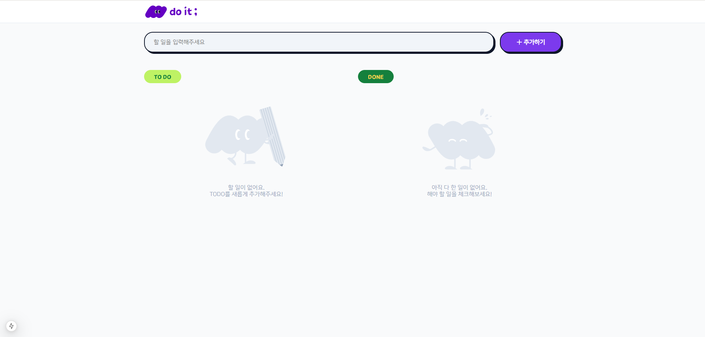
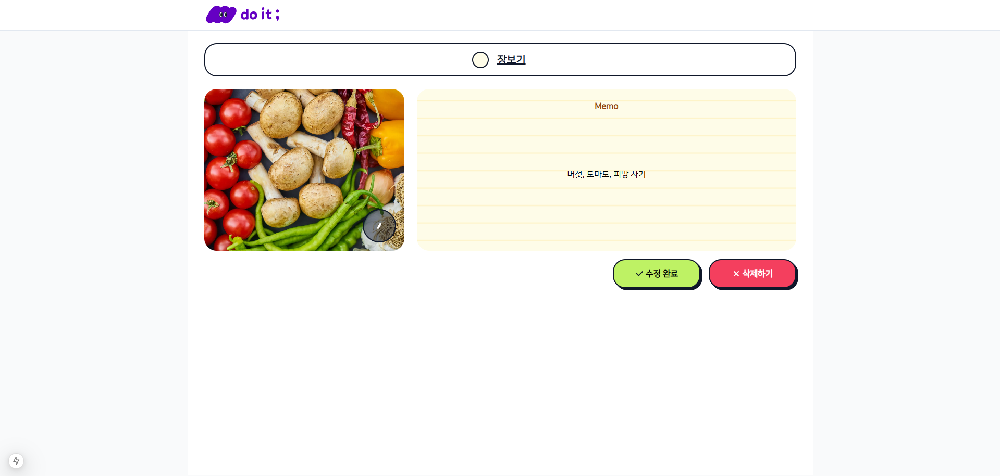

# 📝Todo List

할 일 목록을 관리하는 Todo 서비스입니다.

할 일을 등록하고 사진과 메모를 함께 저장해 효율적으로 관리할 수 있습니다.

---

## 💻 프로젝트 주요 기능

### 📃**투두 목록 관리**

- 할 일을 입력하면 투두 리스트에 추가할 수 있습니다.
- 투두 리스트의 왼쪽 동그라미 체크박스를 눌러 진행중/완료 상태로 변경할 수 있습니다.

### 🖊 **할 일 수정하기**

- 할 일의 제목을 변경할 수 있습니다.
- 제목 왼쪽의 체크박스를 통해 진행 상태를 수정할 수 있습니다.
- 사진을 등록/변경할 수 있습니다.
  - 이미지 파일 이름은 영어로만 이루어지고, 크기는 5MB 이하만 가능합니다.
- 메모를 등록/변경할 수 있습니다.
- 해당 할 일을 삭제할 수 있습니다.

## ⚒️ 기술 스택
